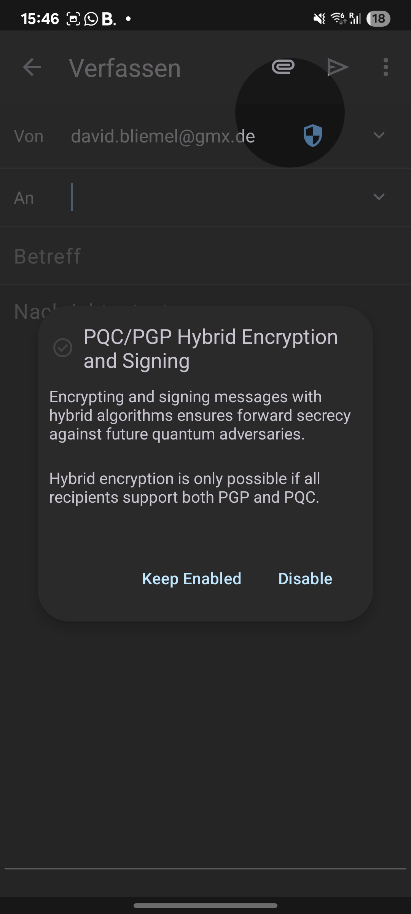
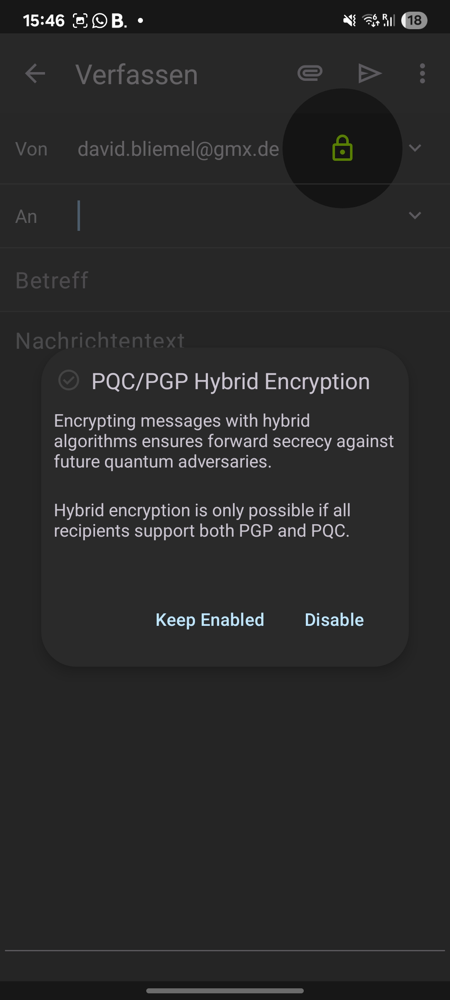
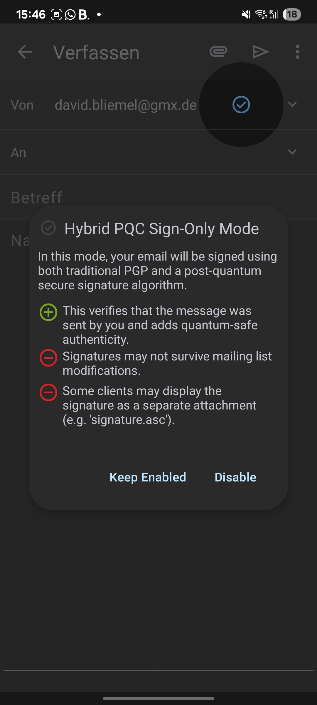
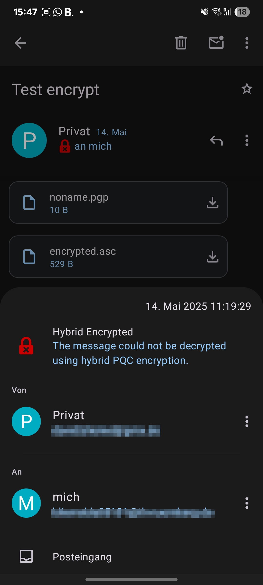
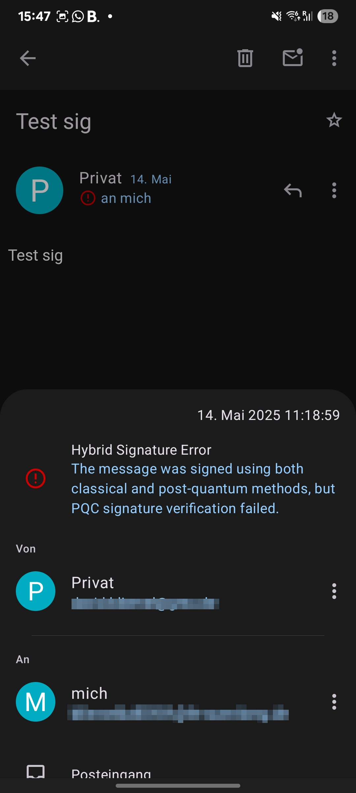

# Thunderbird Android PQC Edition

**Post-Quantum Secure Email für Android – mit hybrider Verschlüsselung und Signatur.**

Dieses Projekt ist ein Fork von Mozillas [thunderbird-android](https://github.com/mozilla-mobile/thunderbird-android), erweitert um Post-Quantum-Kryptografie (PQC) durch die Integration der [`liboqs-java`](https://github.com/open-quantum-safe/liboqs-java) Bibliothek. Ziel ist es, E-Mail-Kommunikation auf mobilen Geräten bereits heute gegen Angriffe durch zukünftige Quantencomputer abzusichern.

---

## ✨ Features

- 🔐 **Hybride Verschlüsselung**: Kombination aus klassischem PGP (RSA/ElGamal) + PQC-Algorithmen (z. B. Kyber).
- ✍️ **Hybride Signatur**: Digitale Signaturen mit klassischem Verfahren + PQC-Verfahren (z. B. Dilithium).
- 📱 **Nahtlose Thunderbird-UX**: Die gewohnte Benutzeroberfläche bleibt erhalten.
- 🔌 **liboqs-java Integration**: Bindings zu liboqs via Java, nativ integriert in den Kryptografie-Stack.

---

## 🧪 Aktivierung der PQC-Funktionen

> ⚙️ Du kannst die PQC-Features in den Einstellungen von Thunderbird aktivieren. Hier ist eine kurze Schritt-für-Schritt-Anleitung mit Screenshots:

1. **Einstellungen öffnen:**  
   `Einstellungen > Konten > Dein Konto > Post-Quantum-Cryptography`
   

2. **PQC-Verschlüsselung und/oder -Signatur aktivieren:**  
   - KEM aktivieren für Verschlüsselung  
   - Sign-Only aktivieren für Signatur  
   - Gewünschten Algorithmus auswählen  
   

3. **PQC-Schlüsselpaar erzeugen, exportieren oder importieren:**  
   

4. **PQC im Mail-Editor aktivieren:**
   - Nur Verschlüsselung:  
     

   - Nur Signatur:  
     

   - Kombination aus beidem:  
     

5. **E-Mail schreiben und absenden.**  
   Bei Erfolg sieht das z. B. so aus:

   - 📧 **Erfolgreich verschlüsselte Nachricht:**  
     

   - ✅ **Erfolgreich verifizierte Signatur:**  
     

6. **Fehlermeldungen bei Problemen:**  
   - 🔴 Verschlüsselung fehlgeschlagen:  
     

   - 🔴 Signaturprüfung fehlgeschlagen:  
     

---

## 🧠 Hintergrund

Mit dem Aufkommen von Quantencomputern stehen klassische asymmetrische Kryptoverfahren wie RSA und ECC langfristig vor dem Aus. Post-Quantum-Kryptografie (PQC) bietet Algorithmen, die auch gegen Angriffe durch Quantencomputer sicher sind. Dieses Projekt kombiniert:

- **liboqs-java**: Bindings zu [Open Quantum Safe's](https://openquantumsafe.org/) C-Bibliothek `liboqs`.
- **Thunderbird E-Mail-Stack**: PGP-Integration mit Bouncycastle.

Durch das hybride Vorgehen bleibt die Kompatibilität mit heutigen Clients erhalten – bei gleichzeitigem Schutz vor zukünftigen Bedrohungen.

---

## 📦 Build & Installation

```bash
git clone https://github.com/DaveMcBeer/thunderbird-android-pqc.git
cd thunderbird-android-pqc
./gradlew assembleDebug
